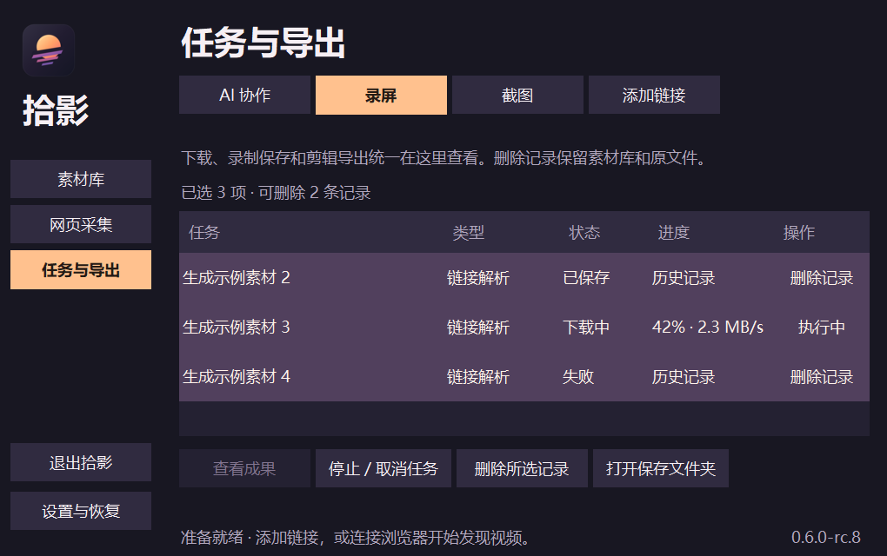
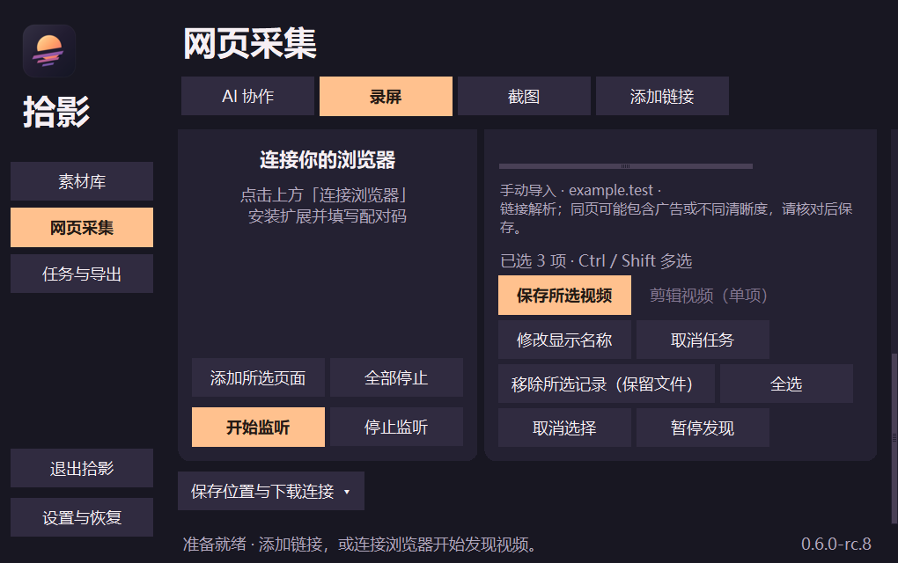
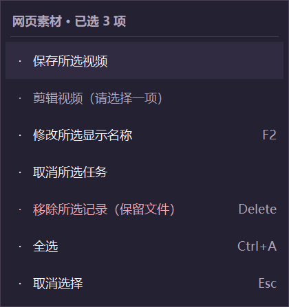

# 0.6.0-rc.8 Windows 预览发布

预览发布页：[v0.6.0-rc.8](https://github.com/NOXEVYR/video-catch/releases/tag/v0.6.0-rc.8)。稳定版保持 [v0.5.0](https://github.com/NOXEVYR/video-catch/releases/tag/v0.5.0)，含历史 Windows/macOS/扩展入口。本轮仅发布已验收Windows包，未重建或更换本机安装。

## 来源

构建输入157文件逐字节匹配 [快照 `80829f78fee2c5acea0cf5eb7d5aa34ca48afd78`](https://github.com/NOXEVYR/video-catch/commit/80829f78fee2c5acea0cf5eb7d5aa34ca48afd78)，树 SHA-256 `416d040bf62a2035dab3ed72cd26bb55b4d3beb6192244ea9ea32f7e01bdc30c` 与包内runtime-manifest一致。原包并非从Git构建，其归档身份与脏状态如实保留；发布标签在快照上增加文档和生成截图，不改变代码或包字节。附件build-source-files和build-provenance记录两次提交及文件差异。原ZIP中的候选说明和旧来源文本保留，以公开说明为准。

Windows包118,769,148字节，SHA-256 `e6bc1d3c855bf8910361e70d8ebbb3d819dd737f30de127f145e1138f52055a1`。既有463项Python与10项扩展测试、包与本机运行收据被脱敏后用于验证附件。发布阶段只检查现成产物、公开附件元数据与服务端摘要，没有重新下载或运行公开程序包。

## 展示图及边界

仅筛选自己的生成媒体夹具，未使用私人媒体、真实网页令牌或配对码。离屏捕获图属于验证素材；网页图展示操作区或菜单，不能充当完整页面验收。其他部分捕获存在残影或裁剪，未用作宣传图。

真实鼠标、Explorer/桌面接收、多屏DPI、真实采集设备和声画仍需体验；不宣称全功能无缺陷。软件内自动更新尚未接入，完整解压后手动使用新版本，升级前从旧版托盘退出并保留配置/素材。

仓库中的历史publish_release脚本和工作流仍固定0.5.0，且只由workflow_dispatch触发；不要将其当成本预览发布入口。本次复用现成包手动发布，prerelease=true、make_latest=false，保留全部旧发布与附件。
